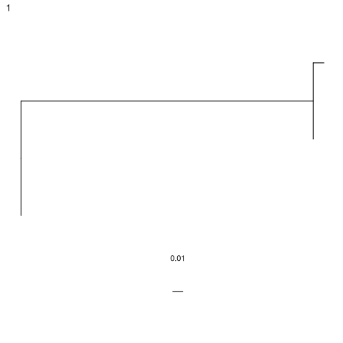

.. _igphyml-quickstart: 

Quick start
===============================================================================

IgPhyML is easiest to use when run indirectly through the R package 
`Dowser <https://dowser.readthedocs.io>`__.
Most of these instructions require Dowser 1.0.0 or higher,
and IgPhyML to be available in the Docker container or compiled locally.

The following commands should work as a first pass on many reasonably sized
datasets, but if you really want to understand what’s going on or make
sure what you’re doing makes sense, please check out the rest of the
website.
 
Build trees and estimate model parameters
-------------------------------------------------------------------------------
 
Open an R session (can type ``R`` into teriminal) in the Docker container::

    #!/usr/bin/R
    library(dowser)
    library(airr)
    library(tidyr)
    library(dplyr)

    # read in data after clonal clustering and germline reconstruction
    data <- read_rearrangement("/usr/local/share/igphyml/examples/example.tsv")

    # format clones for tree building (only 1 clone has >1 unique sequence)
    clones <- formatClones(data)

    # build tree using IgPhyML
    # executable location will be different different if locally compiled
    igphyml_exec <- "/usr/local/share/igphyml/src/igphyml"
    trees <- getTrees(clones, build="igphyml", exec=igphyml_exec)

    # generate plot objects
    plots <- plotTrees(trees)

    # plot tree in console (might not work in Docker)
    plots[[1]]

    # plot trees as a  pdf 
    treesToPDF(plots, file="igphyml_example_trees.pdf")

    # save trees for later
    saveRDS(trees, "trees.rds")

    # look at parameters
    print(gather(bind_rows(trees$parameters)))

    # A tibble: 13 × 2
    #   key         value    
    #   <chr>       <chr>    
    # 1 clone       1        
    # 2 nseq        2        
    # 3 nsite       106      
    # 4 tree_length 0.2865   
    # 5 lhood       -147.7453
    # 6 kappa_mle   1.9527   
    # 7 omega_mle   0.7074   
    # 8 wrc_2_mle   4.3296   
    # 9 gyw_0_mle   2.6478   
    #10 wa_1_mle    5.5308   
    #11 tw_0_mle    0.7451   
    #12 syc_2_mle   -0.99    
    #13 grs_0_mle   0.2133  
 

   Lineage tree of example clone.

These commands process an AIRR-formatted dataset of BCR sequences that have been
`clonally clustered <https://scoper.readthedocs.io/en/stable/vignettes/Scoper-Vignette/>`__
with `germlines reconstructed <https://dowser.readthedocs.io/en/latest/vignettes/Germlines-Vignette/>`__.
It then quickly builds trees using the GY94 model and, using these
fixed topologies, estimates HLP19 model parameters. If analyzing multiple trees, this can be sped up by
setting the ``nproc`` option for ``formatClones`` and ``getTrees``. Note that IgPhyML will run slowly when applied to large datasets,
so it may be worth down-sampling your data if you have clones larger than 100 unique sequences, 
and removing clones with < 5 sequences if you have a many clones.

In addition to IgPhyML, Dowser offers many options for 
`building trees <https://dowser.readthedocs.io/en/latest/vignettes/Building-Trees-Vignette/>`__ and
`visualizing trees <https://dowser.readthedocs.io/en/latest/vignettes/Plotting-Trees-Vignette/>`__ which 
may be more computationally efficient for larger datasets but don't estimate the same potentially 
parameters as IgPhyML, such as omega (aka dN/dS or R/S).

To see more advanced options for IgPhyML tree building in Dowser, check out the documentation
for `buildIghyml <https://dowser.readthedocs.io/en/latest/topics/buildIgphyml/>`__. You can pass any
option of this function to getTrees, e.g. 
``getTrees(clones, partition="cf", build="igphyml", exec=igphyml_exec)`` to estimate separate omegas for
CDRs and FWRs. 

